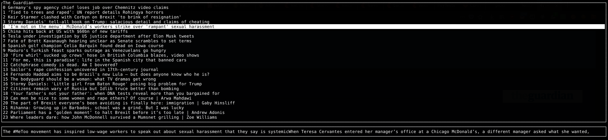

# TerminalRSS
Golang RSS reader in terminal with go-tui, a terminal UI library

### Building

`go build`

### Running

`./TerminalRSS`

### Using

Use the arrow keys to move through the UI, exit with `q`, open link in Firefox with `Enter`

### Add RSS feeds

To add RSS feeds, update the JSON file `links.json`

### Cleanup feeds

To clean feeds, add the title of the feed and the corresponding regex expression in the JSON file `cleaners.json`

### How it looks?

